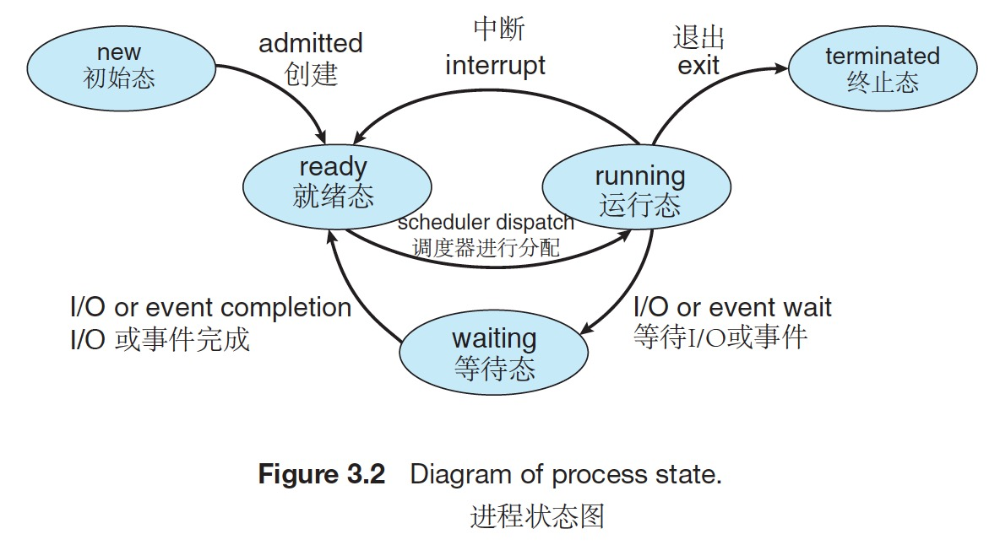
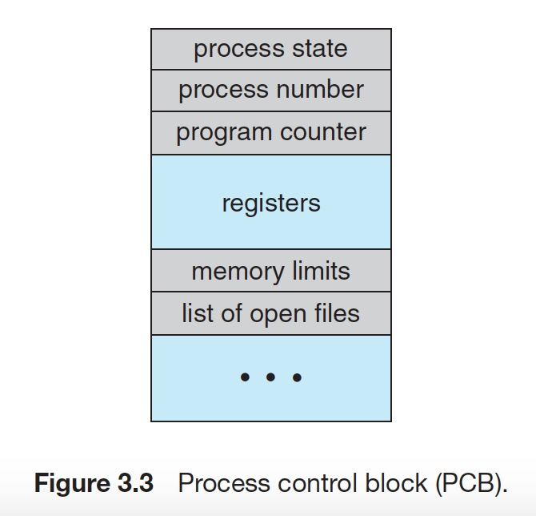
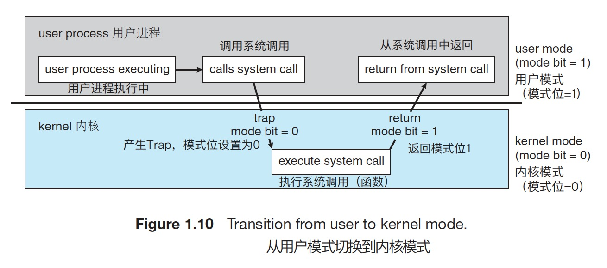
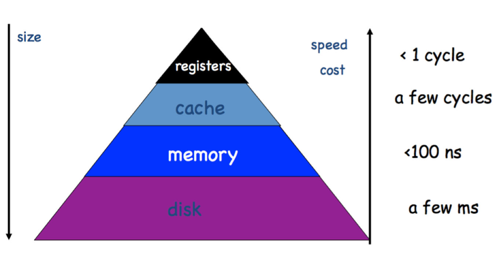

# CSE108 Review 复习指南

## Process 进程

被加载到内存中执行的程序，就被称作进程。

如果还不太能理解进程，就打开你电脑上的的活动监视器或任务管理器：


### States 进程的状态

As a process executes, it changes state. The state of a process is defined in part by the current activity of that process. A process may be in one of the following states:

进程执行时，它的状态（state）是不断变化的。可以说，进程的状态一定上是因进程当前的活动（current activity）所决定的。进程可以处于以下的任意一种状态。



- New. The process is being created.

  初始态。进程一创建完，他就进入了初始态。此时操作系统会进行许可控制（admission control）。如果系统认为该进程没问题，便允许进程（admit）创建，操作系统会为该进程分配并初始化一个进程控制区块（process control block，见下）以及一些初始资源。

- Ready. The process is waiting to be assigned to a processor.

  就绪态，进程正等待被分配给某一个处理器的状态。当进程已经获许（admitted），得到了初始资源以后，程序就处于就绪态，等待调度器对它进行分配送入CPU

- Running. Instructions are being executed.

  运行态，不断执行程序指令（instructions）的状态。此时，进程可能被中断（interrupted），发生上下文交换（context switching）；也可能进入等待态。

- Waiting. The process is waiting for some event to occur (such as an I/O completion or reception of a signal).

  等待态，进程在等待某一事件发生（如等待I/O端完成工作或接受一个信号）

- Terminated. The process has finished execution.

  终止态，进程完成执行了。注意，程序出错了也可能导致程序进入终止态。

进程的状态图就像一个微笑的昆虫，不是吗？尝试用图像去记忆可能发生的状态变化，以记住状态的类型。

### Process Control Block (PCB) 进程控制区块

Process Control Block (PCB): contains information associated with each process: process state, PC, CPU registers, scheduling information, accounting information, I/O status information

进程控制区块：进程控制区块是一个数据结构，操作系统会为每一个它需要管理的进程分配一个PCB。每个PCB都包含了与之相关联的进程的信息。这些信息包括：进程状态，进程的程序计数器（Program Counter）的信息，CPU寄存器的信息，调度信息（如该进程已经被CPU执行了多长时间）等等等等……



### Context Switching 上下文切换

现在你已经知道了PCB是用来保存各个进程信息的数据结构了。那么进程状态图中从运行态（running）受到中断（interrupt）切换到就绪态再返回到运行态的这个过程具体又是什么情况呢？

首先进程A先执行，如果受到了中断（如果该进程是系统进程，则该中断可能为一个系统调用／system call）切换到另一个进程B时，则进程A的状态信息都会先保存在它的PCB中。等到调度器再把进程A加载到CPU中时，CPU重新读取该进程的PCB数据即可恢复该进程之前的状态。这种在进程之间切换的做法叫做上下文切换（context switching）。或者说，CPU是通过上下文切换（via context switch）来实现进程间切换的。


如图所示的是一个上下文切换的过程，此处有*P<sub>0</sub>*和*P<sub>1</sub>*两个进程。进程*P<sub>1</sub>*正处于就绪态，它的PCB信息保存在PCB<sub>1</sub>中。从图中可以看出，进程*P<sub>0</sub>*在开始就收到了中断（或系统调用），于是它把它的信息保存在PCB<sub>0</sub>中，之后*P<sub>1</sub>*从PCB<sub>1</sub>中读取它之前保存的各种信息以恢复进程，并开始执行；之后它又收到中断（或系统调用）信号，于是它又把当前自己的信息保存到PCB<sub>1</sub>，并进入就绪态。此时，经过调度器分配，进程*P<sub>1</sub>*回到CPU，它读取了它存储在PCB<sub>0</sub>上的信息，以恢复它自身，并继续执行。

## 线程

Threads are fundamental unit of CPU utilization that forms the basis of multi-threaded computer systems. It comprises  a thread ID, a pc, a register set and a stack. 

线程是多线程计算机系统中CPU使用的基本单位。单个线程由一个线程ID，一个程序计数器，一个寄存器组和一个栈构成。

It shares its code, data, and other os resources (open files and signals) with other threads belonging to the same process.

线程与同一进程下的其他线程共享线程自身的代码、数据以及其他操作系统的资源（比如打开了的文档以及信号）。

If a process has multiple threads of control, it can perform more than one task a time.

如果一个进程有多个线程进行控制，则它可以在同一时间内做不止一件事情。

### More on Threads 更多关于线程的信息

进程（process）是一个程序的一个执行实例（executing instance）。这是什么意思呢？举个例子，当你双击打开你的Word文档的时候，你就开始了一个运行Word这个程序的进程。线程（thread）是进程中的一条执行路径。一个进程可以包含多条线程。当你打开Word时，操作系统为Word创建了一个进程，并执行该进程的主线程（primary thread）。而主线程，就像java编程中的main方法。

使用了多个线程的程序被称为多线程（multi-thread）的程序。多线程程序的优点可以用一个常见的例子来阐述：你有一个文本处理器（比如word），它的后台线程（background-thread）正负责打印一个文档，同时另一个线程正负责着接收用户的输入——你可以同时做两件事，这是多棒的特性！

如果我们用的应用程序只用了一个线程，那这个程序在同一时间内就只能做一件事情。拿刚提及的文字编辑器为例，如果那是一个单线程（single thread）的应用程序，那它在同一时间内又打印又能对用户输入做出相应就变成不可能了。

进程往往被认为是重量的（heavyweight）。值得注意的是，一个线程可以做到一个进程可以做的任何事情。又由于一个进程可以包含多个线程，线程往往被当作一种“轻量的（lightweight）”进程。因此可以实现简化代码以及提高效率的效果。内核就通常是多线程的。

另一个线程与进程间的主要区别是在同一进程下的线程共享同一地址空间（address space），但不同的进程之间则不共享（即不同的进程之间是相互独立的）。这使得同一个进程下的线程能够读写同一个数据结构（如下图中的代码、数据及文件），也使得线程之间的交流更为方便了。进程间的交流（即IPC，inter-process communication）是十分困难且资源密集的（resource-intensive，这个词用于表示需要占用大量系统资源）。


### Multi-threading models 多线程模型

操作系统通过两条途径来提供线程支持，用户层使用的用户线程（user threads）以及内核层的内核线程（kernel threads）。用户线程受内核支持，不需要内核直接管理，但内核线程是直接由操作系统直接支持和管理的。用户线程和内核线程之间必然存在一种联系，这就涉及到了多线程模型（Multi-threading models）。

这些多线程模型的图就像烧香一样，考虑从图像方面尝试记忆。

#### Many to One Model 多对一

The many-to-one model (Figure 4.5) maps many user-level threads to one kernel thread. Thread management is done by the thread library in user space, so it is efficient (we discuss thread libraries in Section 4.4). However, the entire process will block if a thread makes a blocking system call. Also, because only one thread can access the kernel at a time,multiple threads are unable to run in parallel on multicore systems.

许多用户线程映射到同一内核线程。线程的管理是通过线程库（thread library，它是一个提供给用户创建及管理线程的应用程序接口／API的库，它能帮助管理线程）在用户空间（user space）中进行的，因此效率比较高（线程不受内核的过多约束，比如，不需要要求内核线程进行调度），但如果有一个线程发起了一个阻塞性系统调用（blocking system call，即能导致系统陷入某种阻塞／等待状态的系统调用，比如请求用户输入数据），整个进程都会陷入停滞状态（如果用户不输入数据，就没有任何返回值，发起的这个系统调用如果不能得到返回值，该程序就会一直停留在内核模式，从而阻塞了整个程序的运行）。同时，由于一次只能有一个用户线程访问内核线程，多线程不能在多核系统上平行运行（平行运行就是同时运行，多核就是一个芯片集成多个CPU处理器，多核系统中的每个核都能运行一个线程）。


附有关系统调用说明：

系统调用（System call）：程序（软件）向操作系统发出的调用系统服务（a service from the OS）的请求称为系统调用（系统服务比如I/O服务，这当然就涉及让用户来完成输入输出的操作的请求）。从程序的角度去理解的话，其实系统服务就是内核程序中的一个个函数，用户的程序请求调用内核程序中的这些函数就叫系统调用。

双模式（Dual-mode）是一种通过区分用户模式（user mode）和内核模式（kernel mode）的来回切换允许操作系统保护它自身以及其他系统中的组成部分的一种操作。计算机系统中的硬件有一位模式位（mode bit）用于表示当前操作的执行环境究竟是用户模式还是内核模式。比如，在系统开机引导（boot）时硬件先进入内核模式（模式位为0），并加载操作系统，加载完后就切换到用户模式（模式位为1）下去执行用户的程序（比如打开浏览器）的操作。只要对计算机的控制权在操作系统手里，就说明计算机处于内核模式；在运行用户程序的时候，系统会将硬件的模式位设置为1，控制权会被交还给用户程序，使得计算机处于用户模式。



#### One-to-One Model 一对一模型

The one-to-one model (Figure 4.6) maps each user thread to a kernel thread. It provides more concurrency than the many-to-one model by allowing another thread to run when a thread makes a blocking system call. It also allows multiple threads to run in parallel on multiprocessors. The only drawback to this model is that creating a user thread requires creating the corresponding kernel thread. Because the overhead of creating kernel threads can burden the performance of an application, most implementations of this model restrict the number of threads supported by the system.

一对一模型中，每个用户线程都映射到一个不同的内核线程。该模型在一个线程执行阻塞性系统调用时，能让另一个线程继续执行，因此提供了更好的并发性（concurrency，同时发生之意）。这种模型的唯一缺点在于每创建一个用户线程就得创建一个相应的内核线程，这样的开销（overhead）影响了应用程序的性能。所以这种模型的多数实现都限制了用户能创建的线程的数量。


#### Many-to-Many Model 多对多模型

The many-to-many model (Figure 4.7) multiplexes many user-level threads to a smaller or equal number of kernel threads. The number of kernel threads may be specific to either a particular application or a particular machine (an application may be allocated more kernel threads on a multiprocessor than on a single processor).

Let’s consider the effect of this design on concurrency. Whereas the many-to- one model allows the developer to create as many user threads as she wishes, it does not result in true concurrency, because the kernel can schedule only one thread at a time. The one-to-one model allows greater concurrency, but the developer has to be careful not to create too many threads within an application (and in some instances may be limited in the number of threads she can create). The many-to-many model suffers from neither of these shortcomings: developers can create as many user threads as necessary, and the corresponding kernel threads can run in parallel on a multiprocessor. Also, when a thread performs a blocking system call, the kernel can schedule another thread for execution.


多对多模型将多个用户级线程（user-level threads）映射到同等数量或更少的内核线程中。内核线程的数量可能与特定的应用程序或者特定的机器有关（比如，运行于多处理器的机器上的应用程序，相对于那些运行于在单处理器的机器上的应用程序来说，可以分配更多的内核线程），开发者可以应需创建任意多的用户线程，但是由于内核一次只能调度自身的一个线程，所以并没有增加并发行（请仔细观察模型的图片描述）。一对一模型相对提供了更高的并发性，但创建过多的线程会增大开销，但多对多没有这个问题。多对一模型会导n致阻塞性系统调用的问题，多对多模型也没有，它可以通过内核调度（schedule）另一个内核线程来继续执行程序实现避免阻塞。

### Synchronization 同步

什么叫同步？比如现在你手中有一个文件，对这个文件有两种可以进行的操作：读和写。如果程序正在读取这个文件，则写的操作不能同时进行，必须要等待读的操作结束后才能进行写的操作。这其实就是写的操作在**等待同步**的一个例子。用更为通用的话讲，就是一个线程A在等待另一个线程B做完它手头的事情，这样线程A才能继续执行。

#### Mutex 互斥锁

一个最常见同步（线程同步或进程同步都可，此处拿线程举例）的工具是互斥锁（mutex，拼写源自英语mutual exclusion，表示的意思是互斥；想想高中学过的互斥事件，就是两个不可能同时发生的事件，在此处的语义与之类似，表示能使两个不同的线程不能同时进行操作的某个像锁一样的工具）。举个例子，现在有两个线程要往一个单向链表中插入元素，线程1要插入数字1，线程2要插入数字2，那么，当两个线程同时运行，会发生什么可能的情况？此处的这个单向链表，是两个线程都可以进行修改的数据，也就是说，该数据在线程1和线程2之间共享（这类数据被称作shared variables，共享变量）。可能最终插入的顺序是2-1，也可能是1-2。但还会有别的问题。单向链表中的插入操作涉及到对指针的更新操作，假设现在插入的顺序是1-2，那么就是线程1在先插入数字1，线程2再插入数字2。线程1在插入数字1时先新建了一个节点A，然后更新节点A的指针指向原先的头元素（head element），并更新头元素为这个节点A。但是，如果此时线程2同时在进行插入的操作：线程2先新建节点B，注意，如果此时线程A还未更新头元素为节点A，那么此时更新节点B的指针会使B仍指向原先的头元素，这样节点A和节点B就同时指向原先的节点了，破坏了链表的数据结构。

为了防止这种情况发生，我们规定当线程1在进行插入操作的时候，线程2不会执行它的插入操作，反之亦然：线程2在进行插入操作的时候，线程1不会执行它的插入操作。实现这一点用的就是互斥锁mutex：在线程1要执行插入操作之前，先锁上这个mutex，然后再执行插入操作；如果此时线程2也要执行插入操作，那么它也要先尝试上锁这个mutex。如果此时mutex已经被线程1锁上了，则线程2会陷入一个等待的状态（blocking state），只有当线程1结束它的插入操作后，锁才会被解开，此时线程2才能锁上这个mutex，执行它的插入代码。注意，线程1和线程2谁先上锁是不一定的。

```java
// Thread 1
lock(mutex){ // lock the mutex
  list.insert(1); // insert element 1 to list
} // unlock

// Thread 2
lock(mutex){ // lock the mutex
  list.insert(2); // insert element 2 to list
} // unlock
```

#### Condition Variables 条件变量

另一种同步的工具是条件变量（condition variables）。举个生产者-消费者（Producer and Consumer）的例子：现在有一个能装有限数量元素的列表，多个生产者线程不断地往列表中添加元素，当列表满时，消费者线程清空该列表。假设此时消费者代码先执行，它会判断是否列表已满，如果列表不为空，则开始进入等待状态（见下消费者代码中的wait部分）：

```java
// producer: insert to list
lock(mutex) { // lock the mutex
  list.insert(1);
  if (list_not_full = false) {
    Signal(list_full); // notify thread consumer
  }
} // unlock

// consumer: clear the list
lock(mutex) { // lock the mutex
  while(list_not_full = true) { // judge condition
    wait(mutex, list_full); // wait and release the lock
  }
  list.removeAll(); // remove all the elements in the list
}
```

进入等待状态时，消费者会释放锁，并设置一个能被激活的条件变量`list_full`。此时生产者线程就可以上锁了，并开始插入元素。当多个生产者线程分别插入了元素，导致最后列表满时，最后一个插入元素的生产者线程会判断到列表已满，并发送这个条件变量`l ist_full`（相当于一个信号）给消费者线程。消费者线程接收到这个条件变量后，在生产者线程解锁后自动上锁，并执行`removeAll`操作。

#### Monitor 管程

Monitor is a high-level abstraction that provides a convenient and effective mechanism for process synchronizatifon.

管程（monitoe）是一个能为**进程同步**提供一个方便而有效的机制的高度抽象结构。mutex和condition variable其实两个数据结构，被称作同步设施（synchronization constructs）。想象一下，如果你在一个程序大量的使用mutex和condition variable，那么在自己编码的情况下是很容易出错的（需要大量的手动上锁和解锁代码）。monitor大大降低了程序员的编程负担，它通过将mutex和condition variable高度抽象化的方式，使得程序员不需要自己写上锁解锁的代码（即不需要显式地编写同步代码，同步代码就是用于同步的代码，比如`lock(mutex){…}`），直接使用monitor就能实现自动上锁和自动解锁的功能，如果还需要使用更复杂的同步机制，程序员还可以自己声明condition variable。

```c
monitor{
  /* shared variable declarations */
  function P1 () { // possible entry procedure
    ...
  }
  
  ...
  
  function Pn () { // possible entry procedure
    ...
  }
}
```

使用monitor，只需要声明有哪些共享的资源（shared resources 或 shared variables）、有哪些会使用到这些资源的操作（被称作entry procedures，操作的本质是一个过程／函数，比如读取操作，写入操作）以及可能会用到的condition variables（以实现一些比较复杂的同步机制）。显式地在monitor内部声明这些必要的信息之后，monitoe就可以使用了。

### Deadlock 死锁

Deadlock: Two or more processes are waiting indefinitely for an event that can be caused by only one of the waiting processes (most OSes do not prevent or deal with deadlocks) 

死锁是指两个或多个进程互相无限等待对方触发一个只有它们中的一员才能触发的某一个事件。

## Cache 缓存机制

在电脑的主板上有一个时钟，它是机器的内部时钟（internal clock），我们说这个时钟每“滴答”一下就是一个clock cycle。

CPU在执行指令的时候常常要从内存中获取数据。但是直接从内存获取往往需要比较长时间。于是，计算机的设计者提出了缓存（cache）这个概念。至于内存与寄存器之间的缓存可以用于存储经常需要访问的数据，当CPU要获取数据时，它会先试着访问缓存来查看其中有没有要使用的数据，如果没有，它再到内存中去寻找。在整个计算机架构中，缓存（此处的缓存指的是CPU与内存之间的）的速度仅次于寄存器，从缓存器中获取数据只需要几个cycle的时间，而从内存获取的时间则需要用ns（nanosecond，微毫秒，1微毫秒为十亿分之一秒！）计量！可见其速度差距之大。

回忆一下上学期内存的bottleneck问题，你能理解缓存对于回忆一下上学期内存的bottleneck问题，你能理解缓存对于减轻CPU与内存之间速度差异问题有多有效吗？




## Memory Management 内存管理

### Base and Limit Registers 基地址与界限地址寄存器

Base and limit registers define logical address space usable by a process

基地址寄存器（base register）与界限地址（limit register）寄存器规定了一个进程可以使用的地址（逻辑地址）空间。对于正在运行的进程，操作系统在这两个寄存器中分别存入基地址和区间长度以形成一个个区间，把各个不同的进程（用户进程）分隔开。进程可以使用这两个地址之间的空间作为这个应用可以使用的内存。如图下的300040到420940这一区段就是第二个进程可以使用的内存空间（注意，此处base register存储的是基地址（可以当做是这个进程使用的内存区间的上界），但是limit register存储的不是这一段进程的底地址（即不是下界的地址）而是跨越的内村地址的数量；以下图为例，要得到下界地址420940，需要将base register中的地址加上limit register中的大小，即300040+120900）：


那么，操作系统是如何保护这一段内从空间中的数据的呢？CPU会对用户模式下执行的程序想要访问的地址做一个判断，如果这个程序访问的地址不在给这个程序分配的区间内，系统就会报错以防止用户程序修改到操作系统或其他用户程序的数据。具体比较的方式参见下图：


CPU从用户处接收到用户程序想要访问的地址，然后先判断这一个地址是不是在基地址寄存器中存储的地址位置之后（比如程序要访问的地址是300050，base register中的地址是300040，则CPU会进入下一步判断），再判断这个地址是不是在“base register 中的值”+“limit register中的值”得到的地址的值之前。只有在这个程序的进程所处的区间之内才能够继续访问内存，否则报错（trap）。

### Logical and Physical Address 逻辑地址与物理地址

